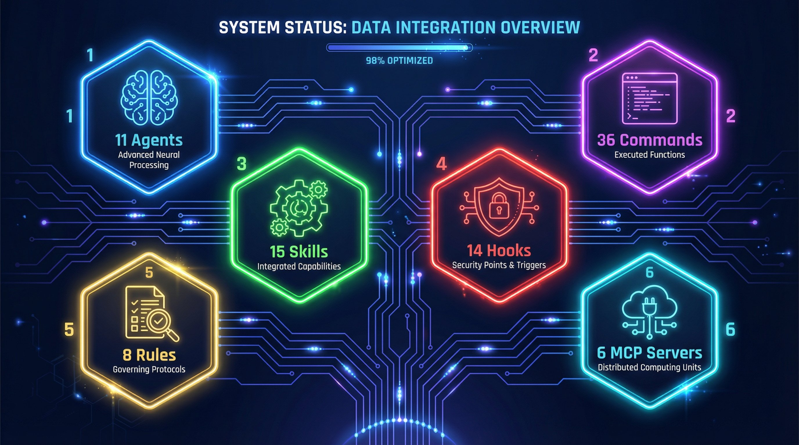
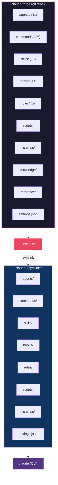
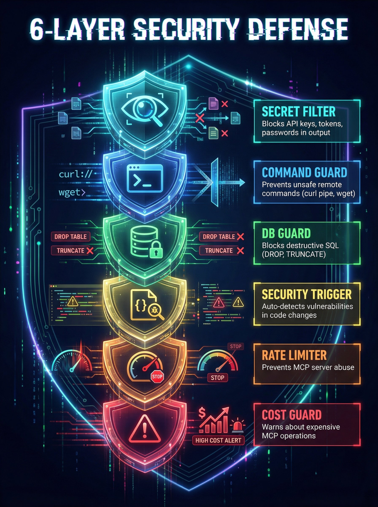

<picture>
  <source media="(prefers-color-scheme: dark)" srcset="docs/banner.png">
  <source media="(prefers-color-scheme: light)" srcset="docs/banner-light.png">
  
</picture>

<p align="center">
  <strong>Turn Claude Code into a full development environment</strong>
</p>

<p align="center">
  <a href="LICENSE"></a>
  <a href="https://claude.com/claude-code"></a>
  <a href="https://github.com/sangrokjung/claude-forge/stargazers"></a>
</p>

<p align="center">
  <a href="#-quick-start">Quick Start</a> &bull;
  <a href="#-development-workflows">Workflows</a> &bull;
  <a href="#-whats-inside">What's Inside</a> &bull;
  <a href="#-installation-guide">Installation</a> &bull;
  <a href="#-architecture">Architecture</a> &bull;
  <a href="#-customization">Customization</a> &bull;
  <a href="README.ko.md">한국어</a>
</p>

---

## What is Claude Forge?

Claude Forge transforms **Claude Code** from a basic CLI into a **full-featured development environment**. One install gives you 11 specialized agents, 36 slash commands, 15 skill workflows, 14 automation hooks, and 8 rule files -- all pre-wired and ready to go.

> Think of it as **oh-my-zsh for Claude Code**: the same way oh-my-zsh enhances your terminal, Claude Forge supercharges your AI coding assistant.

---

## ⚡ Quick Start

```bash
# 1. Clone
git clone --recurse-submodules https://github.com/sangrokjung/claude-forge.git
cd claude-forge

# 2. Install (creates symlinks to ~/.claude)
./install.sh

# 3. Launch Claude Code
claude
```

`install.sh` symlinks everything to `~/.claude/`, so `git pull` updates instantly.

---

## 🔄 Development Workflows

Real-world workflows that chain commands, agents, and skills together.

### Feature Development

Build new features with a plan-first, test-first approach:

```
/plan → /tdd → /code-review → /handoff-verify → /commit-push-pr
```


| Step | What happens |
|:-----|:-------------|
| `/plan` | Restate requirements, assess risks, create step-by-step plan. Wait for user confirmation. |
| `/tdd` | Write tests first (RED), implement minimal code (GREEN), refactor (IMPROVE). Target 80%+ coverage. |
| `/code-review` | Automated security + quality review of all uncommitted changes. |
| `/handoff-verify` | Record intent, then spawn a fresh-context agent to validate build/lint/test independently. |
| `/commit-push-pr` | Run full verification, commit, push, create PR, optionally merge. |

### Bug Fix

Fast turnaround for bug fixes with automatic retry:

```
/explore → /tdd → /verify-loop → /quick-commit
```

| Step | What happens |
|:-----|:-------------|
| `/explore` | Navigate and analyze codebase to understand the issue. |
| `/tdd` | Write a failing test that reproduces the bug, then fix it. |
| `/verify-loop` | Auto-retry build/lint/test up to 3 times with auto-fix on failure. |
| `/quick-commit` | Fast commit for simple, well-tested changes. |

### Security Audit

Comprehensive security analysis combining CWE and STRIDE:

```
/security-review → /stride-analysis-patterns → /security-compliance
```

| Step | What happens |
|:-----|:-------------|
| `/security-review` | CWE Top 25 vulnerability scan + STRIDE threat modeling. |
| `/stride-analysis-patterns` | Systematic STRIDE methodology applied to system architecture. |
| `/security-compliance` | SOC2, ISO27001, GDPR, HIPAA compliance verification. |

### Team Collaboration

Parallel multi-agent execution for complex tasks:

```
/orchestrate → Agent Teams (parallel work) → /commit-push-pr
```

| Step | What happens |
|:-----|:-------------|
| `/orchestrate` | Create an Agent Team with file-ownership separation and hub-and-spoke coordination. |
| Agent Teams | Multiple agents work in parallel on frontend, backend, tests, etc. |
| `/commit-push-pr` | Merge all work, verify, and ship. |

---

## 📦 What's Inside

<p align="center">
  
</p>

| Category | Count | Highlights |
|:--------:|:-----:|:-----------|
| **Agents** | 11 | `planner` `architect` `code-reviewer` `security-reviewer` `tdd-guide` `database-reviewer` + 5 more |
| **Commands** | 36 | `/commit-push-pr` `/handoff-verify` `/explore` `/tdd` `/plan` `/orchestrate` `/security-review` ... |
| **Skills** | 15 | `build-system` `security-pipeline` `eval-harness` `team-orchestrator` `session-wrap` ... |
| **Hooks** | 14 | Secret filtering, remote command guard, DB protection, security auto-trigger, rate limiting ... |
| **Rules** | 8 | `coding-style` `security` `git-workflow` `golden-principles` `agents` `interaction` ... |
| **MCP Servers** | 6 | `context7` `memory` `exa` `github` `fetch` `jina-reader` |

---

## 📥 Installation Guide

### Prerequisites

| Dependency | Version | Check |
|:-----------|:--------|:------|
| Node.js | v22+ | `node -v` |
| Git | any | `git --version` |
| jq | any (macOS/Linux) | `jq --version` |
| Claude Code CLI | ≥1.0 | `claude --version` |

### macOS / Linux

```bash
git clone --recurse-submodules https://github.com/sangrokjung/claude-forge.git
cd claude-forge
./install.sh
```

The installer:
1. Checks dependencies (node, git, jq)
2. Initializes git submodules (CC CHIPS status bar)
3. Backs up existing `~/.claude/` if present
4. Creates **symlinks** for 7 directories + `settings.json` to `~/.claude/`
5. Applies CC CHIPS custom overlay
6. Optionally installs MCP servers and external skills
7. Adds shell aliases (`cc` → `claude`, `ccr` → `claude --resume`)

Because it uses symlinks, `git pull` in the repo updates everything instantly.

### Windows

```powershell
# Run PowerShell as Administrator
.\install.ps1
```

Windows uses **file copies** instead of symlinks. Re-run `install.ps1` after `git pull` to update.

### MCP Server Setup

| Server | API Key | Setup |
|:-------|:--------|:------|
| **context7** | Not required | Auto-installed via `install.sh` |
| **memory** | Not required | Auto-installed via `install.sh` |
| **fetch** | Not required | Requires `uvx` (Python) |
| **jina-reader** | Not required | Auto-installed via `install.sh` |
| **exa** | OAuth | `claude mcp add exa --url https://mcp.exa.ai/mcp` |
| **github** | PAT | Set `GITHUB_PERSONAL_ACCESS_TOKEN` env var |

### Customization

Override settings without modifying tracked files:

```bash
cp setup/settings.local.template.json ~/.claude/settings.local.json
vim ~/.claude/settings.local.json
```

`settings.local.json` merges on top of `settings.json` automatically.

---

## 🏗 Architecture



<details>
<summary><strong>Full Directory Tree</strong></summary>

```
claude-forge/
  ├── agents/               Agent definitions (11 .md files)
  ├── cc-chips/             Status bar submodule
  ├── cc-chips-custom/      Custom status bar overlay
  ├── commands/             Slash commands (28 .md + 8 SKILL dirs)
  ├── docs/                 Screenshots, diagrams
  ├── hooks/                Event-driven shell scripts (14)
  ├── knowledge/            Knowledge base entries
  ├── reference/            Reference documentation
  ├── rules/                Auto-loaded rule files (8)
  ├── scripts/              Utility scripts
  ├── setup/                Installation guides + templates
  ├── skills/               Multi-step skill workflows (15)
  ├── install.sh            macOS/Linux installer (symlinks)
  ├── install.ps1           Windows installer (copies)
  ├── mcp-servers.json      MCP server configurations
  ├── settings.json         Claude Code settings
  ├── CONTRIBUTING.md       Contribution guide
  ├── SECURITY.md           Security policy
  └── LICENSE               MIT License
```

</details>

---

## 🛡 Automation Hooks

### Security Hooks

<p align="center">
  
</p>

| Hook | Trigger | Protects Against |
|:-----|:--------|:-----------------|
| `output-secret-filter.sh` | PostToolUse | Leaked API keys, tokens, passwords in output |
| `remote-command-guard.sh` | PreToolUse (Bash) | Unsafe remote commands (curl pipe, wget pipe) |
| `db-guard.sh` | PreToolUse | Destructive SQL (DROP, TRUNCATE, DELETE without WHERE) |
| `security-auto-trigger.sh` | PostToolUse (Edit/Write) | Vulnerabilities in code changes |
| `rate-limiter.sh` | PreToolUse (MCP) | MCP server abuse / excessive calls |
| `mcp-usage-tracker.sh` | PreToolUse (MCP) | Tracks MCP usage for monitoring |

### Utility Hooks

| Hook | Trigger | Purpose |
|:-----|:--------|:--------|
| `code-quality-reminder.sh` | PostToolUse (Edit/Write) | Reminds about immutability, small files, error handling |
| `context-sync-suggest.sh` | SessionStart | Suggests syncing docs at session start |
| `session-wrap-suggest.sh` | Stop | Suggests session wrap-up before ending |
| `work-tracker-prompt.sh` | UserPromptSubmit | Tracks work for analytics |
| `work-tracker-tool.sh` | PostToolUse | Tracks tool usage for analytics |
| `work-tracker-stop.sh` | Stop | Finalizes work tracking data |
| `task-completed.sh` | TaskCompleted | Notifies on subagent task completion |
| `expensive-mcp-warning.sh` | - | Warns about costly MCP operations |

---

## 🤖 Agents

### Opus Agents (6) -- Deep analysis & planning

| Agent | Purpose |
|:------|:--------|
| **planner** | Implementation planning for complex features and refactoring |
| **architect** | System design, scalability decisions, technical architecture |
| **code-reviewer** | Quality, security, and maintainability review |
| **security-reviewer** | OWASP Top 10, secrets, SSRF, injection detection |
| **tdd-guide** | Test-driven development enforcement (RED → GREEN → IMPROVE) |
| **database-reviewer** | PostgreSQL/Supabase query optimization, schema design |

### Sonnet Agents (5) -- Fast execution & automation

| Agent | Purpose |
|:------|:--------|
| **build-error-resolver** | Fix build/TypeScript errors with minimal diffs |
| **e2e-runner** | Generate and run Playwright E2E tests |
| **refactor-cleaner** | Dead code cleanup using knip, depcheck, ts-prune |
| **doc-updater** | Documentation and codemap updates |
| **verify-agent** | Fresh-context build/lint/test verification |

---

## 📋 All Commands

<details>
<summary><strong>36 Commands (click to expand)</strong></summary>

#### Core Workflow

| Command | Description |
|:--------|:------------|
| `/plan` | Design implementation plan, assess risks. Wait for user confirmation. |
| `/tdd` | Test-driven development: tests first, then minimal implementation. |
| `/code-review` | Security + quality review of uncommitted changes. |
| `/handoff-verify` | Record intent + fresh-context agent validation. |
| `/commit-push-pr` | Full verification → commit → push → PR → optional merge. |
| `/quick-commit` | Fast commit for simple, well-tested changes. |
| `/verify-loop` | Auto-retry build/lint/test up to 3x with auto-fix. |

#### Exploration & Analysis

| Command | Description |
|:--------|:------------|
| `/explore` | Navigate and analyze codebase structure. |
| `/build-fix` | Incrementally fix TypeScript and build errors. |
| `/next-task` | Recommend next task based on project state. |
| `/suggest-automation` | Analyze repetitive patterns and suggest automation. |

#### Security

| Command | Description |
|:--------|:------------|
| `/security-review` | CWE Top 25 + STRIDE threat modeling. |
| `/stride-analysis-patterns` | Systematic STRIDE methodology for threat identification. |
| `/security-compliance` | SOC2, ISO27001, GDPR, HIPAA compliance checks. |

#### Testing & Evaluation

| Command | Description |
|:--------|:------------|
| `/e2e` | Generate and run Playwright end-to-end tests. |
| `/test-coverage` | Analyze coverage gaps and generate missing tests. |
| `/eval` | Eval-driven development workflow management. |
| `/evaluating-code-models` | Benchmark code generation models (HumanEval, MBPP). |
| `/evaluating-llms-harness` | Benchmark LLMs across 60+ academic benchmarks. |

#### Documentation & Sync

| Command | Description |
|:--------|:------------|
| `/update-codemaps` | Analyze codebase and update architecture docs. |
| `/update-docs` | Sync documentation from source-of-truth. |
| `/sync-docs` | Sync prompt_plan.md, spec.md, CLAUDE.md + rules. |
| `/sync` | git pull + sync-docs in sequence. |
| `/pull` | Quick `git pull origin main`. |

#### Project Management

| Command | Description |
|:--------|:------------|
| `/init-project` | Scaffold new project with standard structure. |
| `/orchestrate` | Agent Teams parallel orchestration. |
| `/checkpoint` | Save/restore work state. |
| `/learn` | Record lessons learned + suggest automation. |
| `/web-checklist` | Post-merge web testing checklist. |

#### Refactoring & Debugging

| Command | Description |
|:--------|:------------|
| `/refactor-clean` | Identify and remove dead code with test verification. |
| `/debugging-strategies` | Systematic debugging techniques and profiling. |
| `/dependency-upgrade` | Major dependency upgrades with compatibility analysis. |
| `/extract-errors` | Extract and catalog error messages. |

#### Git Worktree

| Command | Description |
|:--------|:------------|
| `/worktree-start` | Create git worktree for parallel development. |
| `/worktree-cleanup` | Clean up worktrees after PR completion. |

#### Utilities

| Command | Description |
|:--------|:------------|
| `/summarize` | Summarize URLs, podcasts, transcripts, local files. |

</details>

---

## 🧩 All Skills

<details>
<summary><strong>15 Skills (click to expand)</strong></summary>

| Skill | Description |
|:------|:------------|
| **build-system** | Auto-detect and run project build systems. |
| **cache-components** | Next.js Cache Components and Partial Prerendering (PPR) guidance. |
| **cc-dev-agent** | Claude Code development workflow optimization (context engineering, sub-agents, TDD). |
| **continuous-learning-v2** | Instinct-based learning: observe sessions via hooks, create atomic instincts with confidence scoring. |
| **eval-harness** | Formal evaluation framework for eval-driven development (EDD). |
| **frontend-code-review** | Frontend file review (.tsx, .ts, .js) with checklist rules. |
| **manage-skills** | Analyze session changes, detect missing verification skills, create/update skills. |
| **prompts-chat** | Skill/prompt exploration, search, and improvement. |
| **security-pipeline** | CWE Top 25 + STRIDE automated security verification pipeline. |
| **session-wrap** | End-of-session cleanup: 4 parallel subagents detect docs, patterns, learnings, follow-ups. |
| **skill-factory** | Convert reusable session patterns into Claude Code skills automatically. |
| **strategic-compact** | Suggest manual context compaction at logical intervals to preserve context. |
| **team-orchestrator** | Agent Teams engine: team composition, task distribution, dependency management. |
| **verification-engine** | Integrated verification engine: fresh-context subagent verification loop. |
| **verify-implementation** | Run all project verify skills and generate unified pattern verification report. |

</details>

---

## 🤝 Contributing

See [CONTRIBUTING.md](CONTRIBUTING.md) for guidelines on adding agents, commands, skills, and hooks.

---

## 📄 License

[MIT](LICENSE) -- use it, fork it, build on it.
